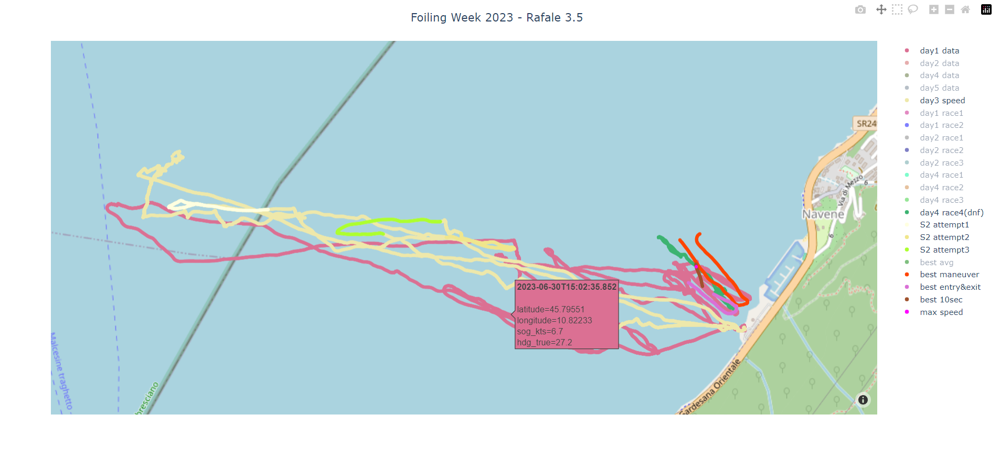

# SailingDataViewer
Viewer and data extraction scripts for sailing data. Built around data exported from Vakaros's Atlas 2 sailing instrument and app, but should work with most csv files with the same columns.

This collections of scripts has been built by me during the SuMoth Challenge 2023 at Foiling Week to help narrowing down and displaying the best performance segments from Rafale's runs. This is in no way production quality code, but did the job. The code is provided as is, and may need to be modified to be made to work again.

## Details
#### [main.py](main.py)

Running `py main.py` with no options will use the paths from [data_paths.py](data_paths.py) and try to load up (as a locally hosted web page) the following map for display. 

**Note: [main.py](main.py) has available command line arguments but they are not implemented.** The other scripts need to be called directly to process the raw race data.

Running `py map_gen.py` is effectively the same as running `py main.py` without arguments and only displays the data.

#### [maneuver_optimiser.py](maneuver_optimiser.py) 

This script extracts the optimised set of data points to find the fastest entry & exit and the fastest average speed for 2 minutes sections that include the timestamps hardcoded (temporarly) in it's `DEF_MANEUVERS` list.

#### [race_extractor.py](race_extractor.py)

Running `py race_extractor.py <file.csv> <race_name> <start> <end>` will extract all the data points between `start` and `end` timestamps to a file called `<race_name.csv>`.

Timestamp format is expected as `hh:mm:ss.000` and are assumed to be from the same day as the first data point from the given csv file.

#### [speed_finder.py](speed_finder.py)

Running `py speed_finder.py` will use the `RAW_DATA` paths from [data_paths.py](data_paths.py) and extract the best single point speed, 10 seconds average speed and 2 mins average speed, creating respectively a csv files for each.
